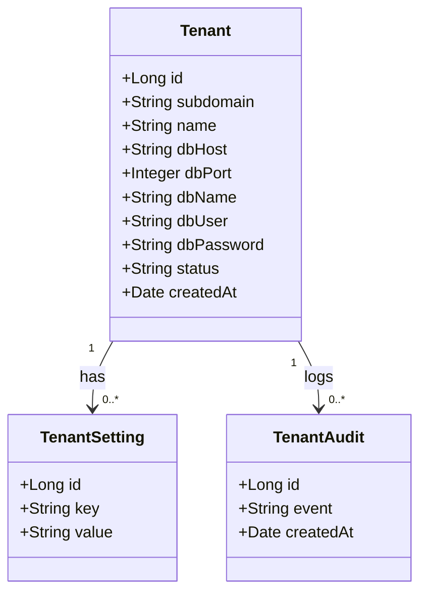
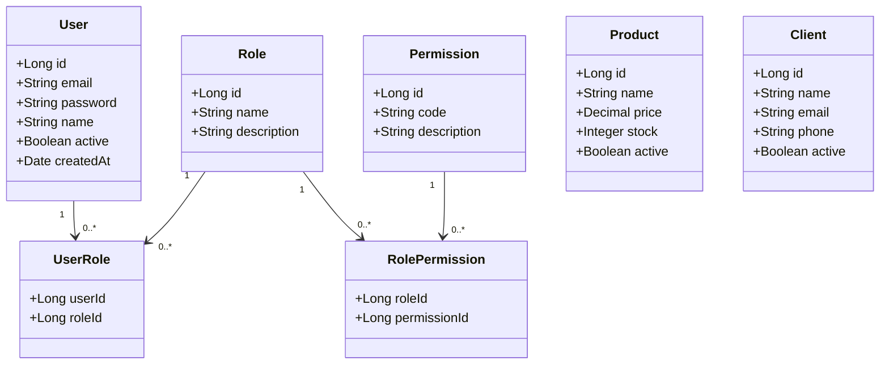
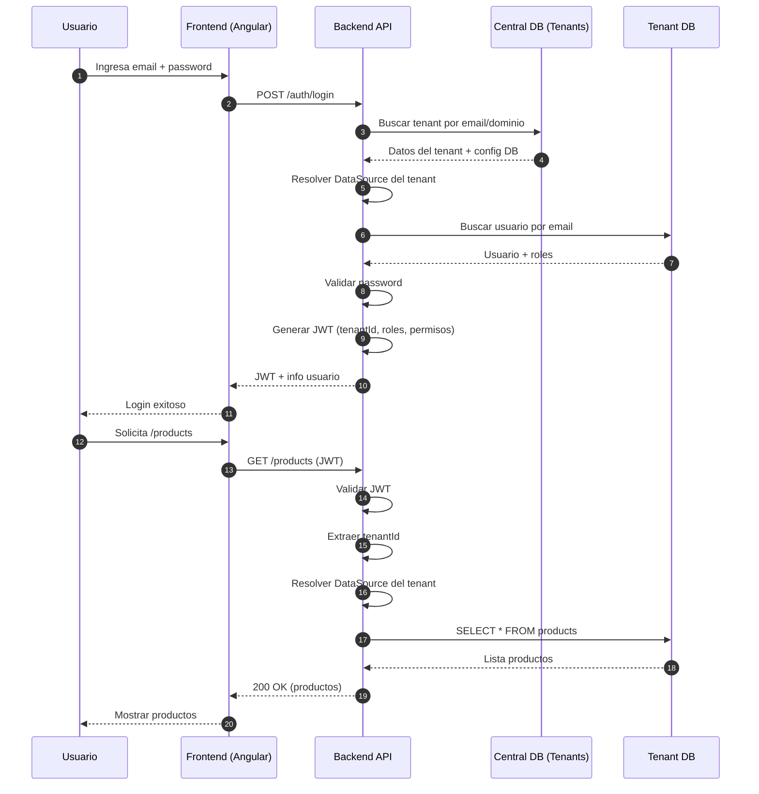

# Arquitectura Multi-Tenant por Subdominio

Este documento describe **el contexto y el modelo de datos** para una arquitectura **multi-tenant con una sola aplicación (frontend + backend)** y **una base de datos por tenant**, donde el **tenant se identifica por subdominio**.

---

## 🎯 Objetivo de la arquitectura

* Un solo **frontend** (Angular) desplegado en S3 + CloudFront
* Un solo **backend**
* Múltiples **tenants (clientes)**
* **Una base de datos por tenant**
* Aislamiento fuerte de datos
* Login compartido, pero **usuarios NO centralizados**

Ejemplo de acceso:

```
https://empresa1.tuapp.com
https://empresa2.tuapp.com
```

---

## 🧠 Contexto general

El sistema se divide en **dos contextos claramente separados**:

1. **Contexto Central (Tenant Resolution)**
   Responsable únicamente de identificar el tenant y resolver la conexión a su base de datos.

2. **Contexto Tenant (Negocio y Seguridad)**
   Responsable de la autenticación, autorización y datos de negocio **de un solo tenant**.

> ⚠️ Regla de oro: **el tenant se resuelve antes de tocar usuarios**.

---

## 🟦 Contexto 1: Base de Datos CENTRAL

### Responsabilidad

* Resolver el tenant a partir del subdominio
* Proveer la información de conexión a la base de datos del tenant
* Mantener configuración mínima del tenant

### Qué NO hace

* No almacena usuarios
* No almacena contraseñas
* No maneja roles ni permisos
* No contiene datos de negocio

---

## 📊 Diagrama de Clases – Base de Datos CENTRAL



---

## 🟩 Contexto 2: Base de Datos de un TENANT (ejemplo)

Cada tenant tiene **su propia base de datos**, con el mismo esquema.

### Responsabilidad

* Autenticación de usuarios
* Autorización (roles y permisos)
* Gestión de datos de negocio

---

## 📊 Diagrama de Clases – Base de Datos del TENANT



---

## 🔐 Flujo de autenticación (resumen)

1. Usuario accede a `https://empresa1.tuapp.com`
2. Backend extrae el subdominio `empresa1`
3. Consulta la BD central para obtener la conexión
4. Se conecta a la BD del tenant `empresa1`
5. Valida usuario y contraseña
6. Carga roles y permisos
7. Genera JWT con `tenantId`

---

## 🧠 Beneficios del diseño

* Aislamiento real de datos
* Alta seguridad
* Escalabilidad horizontal
* Fácil cumplimiento regulatorio
* Un solo frontend y backend

---

## 🏁 Conclusión

Este diseño permite construir un **SaaS multi-tenant profesional**, seguro y escalable, usando subdominios para enrutar a múltiples bases de datos, sin centralizar usuarios ni comprometer el aislamiento.

> **Central DB = resolver a dónde conectarse**
> **Tenant DB = mundo real del negocio**



